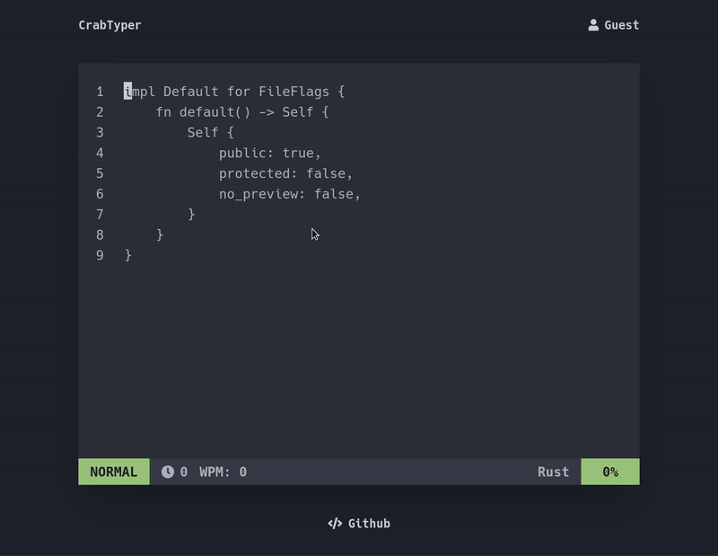

<div align="center">
  <h1>Crabtyper 🦀</h1>
  <p>
    <strong>A speedtyping web app written in Rust</strong>
  </p>
</div>



> This project is inspired by [speedtyper](https://www.speedtyper.dev/) & [monkeytype](https://monkeytype.com/), please go check them out!
## Usage

Surf to `localhost:8080`. 

Click on the text & start typing!

After you typed the code snippet you will see your result with your wpm, time, accuracy & mistakes.\
Then just press `r` to restart the game!

## Installation Guide

### Web

#### Install Rust

```sh
curl --proto '=https' --tlsv1.2 -sSf https://sh.rustup.rs | sh
```

#### Run setup
```sh
cd web/

# Install npm packages
npm run install

# Adds the wasm build target & installs trunk
npm run setup
```

#### Start the development server

```sh
npm run dev
```

### API

#### Install SQLite

```sh
# on OpenSUSE
sudo zypper install sqlite3-devel libsqlite3-0 sqlite3

# on Ubuntu
sudo apt-get install libsqlite3-dev sqlite3

# on Fedora
sudo dnf install libsqlite3x-devel sqlite3x

# on macOS (using homebrew)
brew install sqlite3
```

#### Initialize SQLite Database

```sh
cd api
cargo install diesel_cli --no-default-features --features sqlite

echo "DATABASE_URL=snippets.db" > .env
diesel migration run
```

#### Running Server

```sh
cd api
cargo run (or ``cargo watch -x run``)

# Started http server: 127.0.0.1:5000
```

#### Available Routes

##### `POST /api/languages`

Inserts a new language into the SQLite DB.

Provide a JSON payload with a name. Eg:

```json
{ "name": "Rust" }
```

On success, a response like the following is returned:

```json
{
  "id": "9e46baba-a001-4bb3-b4cf-4b3e5bab5e97",
  "name": "Rust"
}
```

<details>
  <summary>Client Examples</summary>

Using [HTTPie](https://httpie.org/):

```sh
http POST localhost:5000/api/languages name=Rust
```

Using cURL:

```sh
curl -S -X POST --header "Content-Type: application/json" --data '{"name":"Rust"}' http://localhost:5000/api/languages
```

</details>

##### `GET /api/languages`

Gets all languages from the DB.

<details>
  <summary>Client Examples</summary>

Using [HTTPie](https://httpie.org/):

```sh
http localhost:5000/api/languages
```

Using cURL:

```sh
curl -S http://localhost:5000/api/languages
```

</details>

##### `GET /api/snippets`

Gets all snippets from the DB.

<details>
  <summary>Client Examples</summary>

Using [HTTPie](https://httpie.org/):

```sh
http localhost:5000/api/snippets
```

Using cURL:

```sh
curl -S http://localhost:5000/api/snippets
```

</details>

##### `POST /api/snippet`

Inserts a new snippet into the SQLite DB.

Provide a JSON payload with a name. Eg:

```json
{
  "language": "Rust",
  "code": "assert!(if let Ok(c) = config {\n\t\tc == TestConfig {\n\t\t\ta: \"test\".into(),\n\t\t\tb: \"test\".into(),\n\t\t}\n\t} else {\n\t\tfalse\n\t})"
}
```

On success, a response like the following is returned:

```json
{
  "id": "9e46baba-a001-4bb3-b4cf-4b3e5bab5e97",
  "code": "assert!(if let Ok(c) = config {\n\t\tc == TestConfig {\n\t\t\ta: \"test\".into(),\n\t\t\tb: \"test\".into(),\n\t\t}\n\t} else {\n\t\tfalse\n\t})",
  "language": "Rust",
  "language_id": "9e46baba-a001-4bb3-b4cf-4b3e5bab5e97"
}
```

##### `GET /api/snippet`

Gets a random snippet from the DB.

<details>
  <summary>Client Examples</summary>

Using [HTTPie](https://httpie.org/):

```sh
http localhost:5000/api/snippet
```

Using cURL:

```sh
curl -S http://localhost:5000/api/snippet
```

</details>

##### `GET /api/snippet/{language}`

Gets a random snippet by language from the DB.

<details>
  <summary>Client Examples</summary>

Using [HTTPie](https://httpie.org/):

```sh
http localhost:5000/api/snippet/Rust
```

Using cURL:

```sh
curl -S http://localhost:5000/api/snippet/Rust
```

</details>

#### Explore The SQLite DB

```sh
sqlite3 test.db
```

```
sqlite> .tables
sqlite> SELECT * FROM snippets;
```
